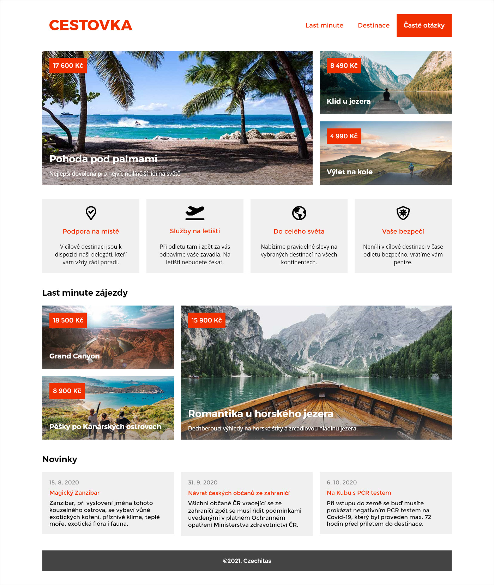

# Úkol: Cestovka

Nastyluj stránku podle ukázky níže.

## Instrukce

- Snaž se použít konvenci BEM pro pojmenování tříd.
- Přemýšlej komponentově - pokud se nějaký prvek používá na stránce opakovaně, zaslouží si být samostatnou komponentou (v terminologii BEMu jim řikáme _blok_).
- Jednotlivé komponenty rozděl do samostatných stylových souborů.
- Nezapomeň, že bloky mohou obsahovat jiné bloky.
- Použij font [Montserrat](https://fonts.google.com/specimen/Montserrat).
- Stránku zveřejni na GitHub pages.
- Odkaz na stránku přidej do popisku repozitáře v sekci About. Do řádku Website vlož adresu, na které je výsledný web hostovaný.
- Další podklady najdeš ve složce `podklady`.

## Bonus (dobrovolný)

- Pro hlavní barvu `#F03000` použij custom property.

- Zařiď, aby byla stránka responzivní. S rozložením pro menší obrazovky se můžeš inspirovat zde [zadani/mobilni.jpg](zadani/mobilni.jpg) a zde [zadani/tabletova.jpg](zadani/tabletova.jpg).
